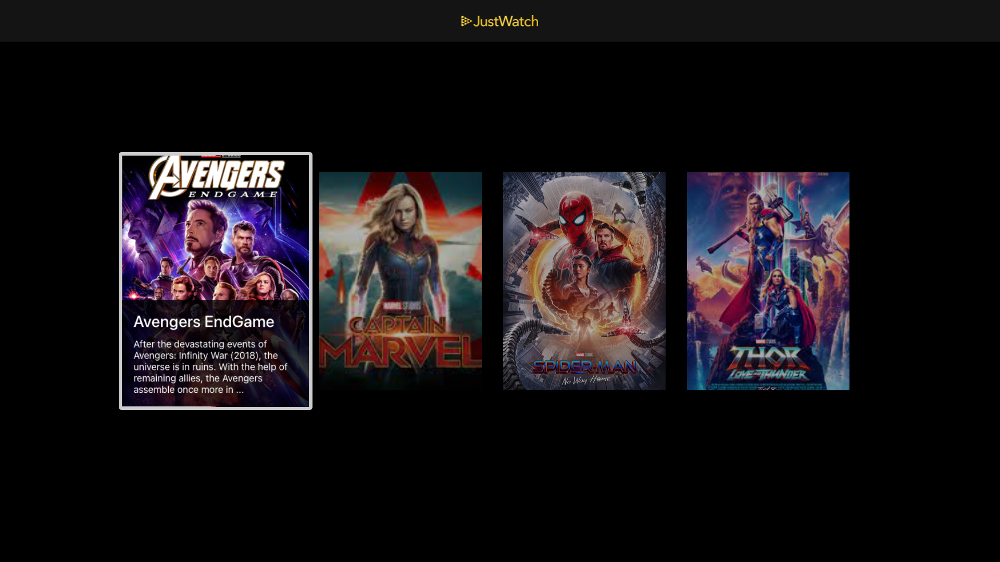

# JustWatch Demo TV APP 

A project to demonstrate basic required architecture for a react-native-tvos app.
The project can run on tvOs and android TV.

## Environment Setup

Following prequsites are needed.

1 Node 14.19.0+.

2 Xcode and Xcode Dev Tools Setup.

3 Android SDK and Android SDK Tools Setup.

You can follow react-native Environment Setup guide for both IOS and Android If you do not already have the above mentioned tools available. Please follow bellow link for further details.

https://reactnative.dev/docs/environment-setup

## How to get started?

1 Clone the project in your system.

2 Go into the root directory where package.json is present.

3 Run command `npm i -g yarn`.

4 Run command `yarn`.

#### For IOS
 
 1 Run command `cd ios`.

 2 Run command `pod install`.

 3 Run command `cd ..`.

 4 Run command `react-native run-ios  --simulator "Apple TV" --scheme "JustWatch-tvOS"`

#### For Android

 1 Make sure android tv emulator is running.
 
 2 Run command `react-native run-android`.

## How it will look?

